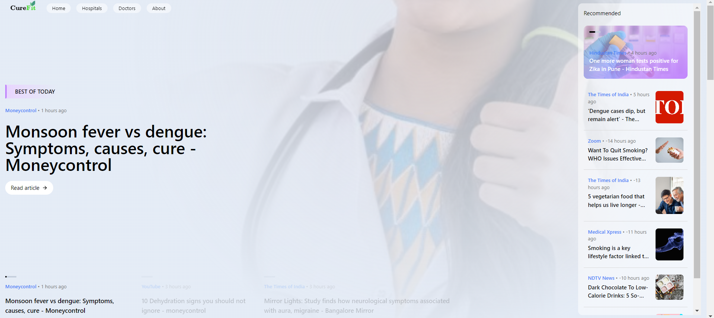

# CureFit

CureFit is a web application that provides users with health-related news, enables them to search for nearby hospitals, and find doctors based on specialties and city.

## Features

- **Health News**: Stay updated with the latest news related to health and wellness.
- **Search Hospitals**: Find hospitals nearby based on your current location.
- **Search Doctors**: Locate doctors by selecting their specialty and city.

## Table of Contents

- [Installation](#installation)
- [Usage](#usage)
- [Screenshots](#screenshots)
- [Contributing](#contributing)
- [License](#license)
- [Contact](#contact)

## Installation

### Prerequisites

- Node.js
- npm (Node Package Manager)
- React

### Steps

1. **Clone the repository**:
    ```bash
    git clone https://github.com/ShivrajCodes/CureFit.git
    cd CureFit
    ```

2. **Install dependencies**:
    ```bash
    npm install
    ```

3. **Start the development server**:
    ```bash
    npm start
    ```

The application should now be running on `http://localhost:3000`.

## Usage

### Home

- Displays the latest health news.
- Users can click on news articles to read more.

## Screenshots

### Home Page




### Search Hospitals

- Users can enter their location to find hospitals nearby.
- Displays a list of hospitals with relevant details.

### Search Doctors

- Users can choose a specialty and a city to find doctors.
- Displays a list of doctors with their contact information and practice details.

## Contributing

We welcome contributions from the community! If you have any ideas, suggestions, or issues, feel free to create a pull request or open an issue on GitHub.

### Steps to Contribute

1. **Fork the repository**.
2. **Create a new branch**:
    ```bash
    git checkout -b feature/YourFeatureName
    ```
3. **Commit your changes**:
    ```bash
    git commit -m 'Add some feature'
    ```
4. **Push to the branch**:
    ```bash
    git push origin feature/YourFeatureName
    ```
5. **Open a pull request**.

## License

This project is licensed under the MIT License - see the [LICENSE](LICENSE) file for details.

## Contact

- **Shivraj** - [shivraj.xe.45@gmail.com](mailto:shivraj.xe.45@gmail.com)
- **GitHub** - [ShivrajCodes](https://github.com/ShivrajCodes)

